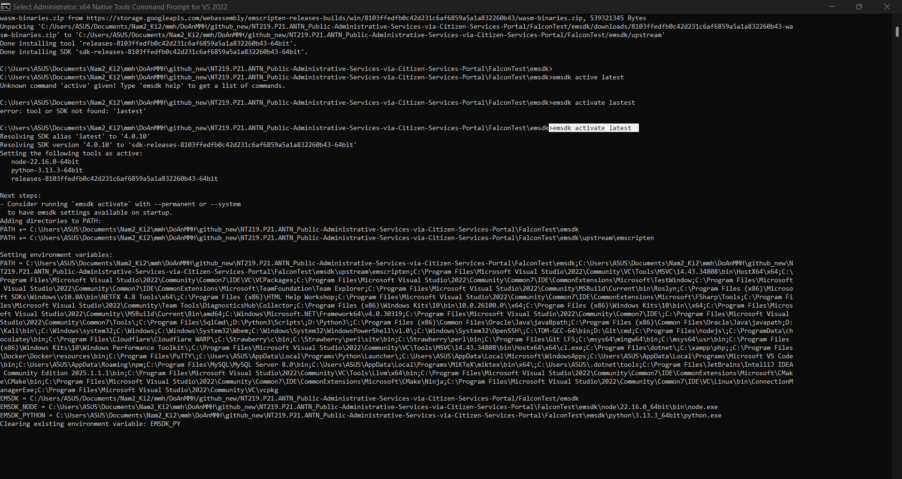
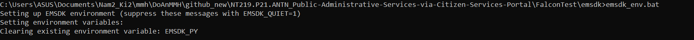
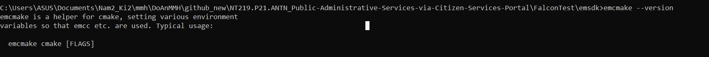
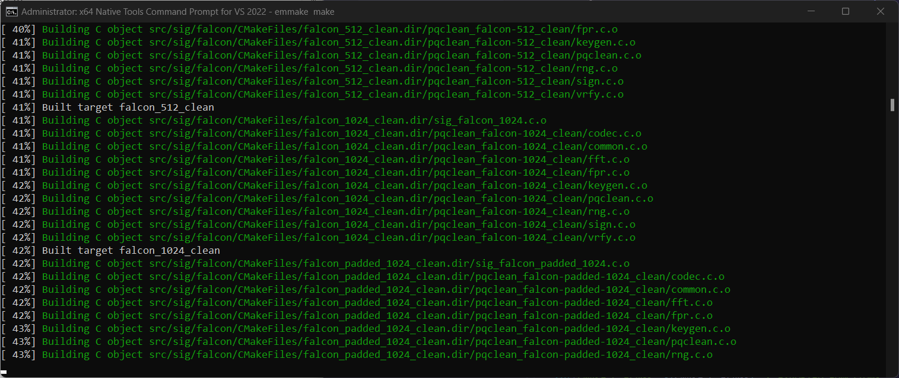

Rất tốt! Bạn đang có thư viện liboqs (thư mục oqs) đã được build với cấu trúc chuẩn:

```makefile
oqs/
├── bin/
├── include/
└── lib/
```
Tuy nhiên, để biên dịch FALCON trong liboqs thành WebAssembly (WASM) để chạy trong ReactJS frontend, bạn cần làm lại build với Emscripten.

## ✅ Hướng dẫn chi tiết: Build FALCON từ liboqs thành WASM
🎯 Mục tiêu: Tạo file liboqs.wasm + liboqs.js từ source gốc để dùng trong trình duyệt.

#### ⚙️ Bước 1: Cài Emscripten (nếu chưa có)
Chạy 1 lần:

- Nhở mở terminal Native... để cài 

```bash
git clone https://github.com/emscripten-core/emsdk.git
cd emsdk
./emsdk install latest
./emsdk activate latest
source ./emsdk_env.sh  # nếu dùng Linux/macOS
emsdk_env.bat          # nếu dùng Windows CMD
```



```bash
C:\Users\ASUS\Documents\Nam2_Ki2\mmh\DoAnMMH\github_new\NT219.P21.ANTN_Public-Administrative-Services-via-Citizen-Services-Portal\FalconTest\emsdk>which emsdk
/c/Users/ASUS/Documents/Nam2_Ki2/mmh/DoAnMMH/github_new/NT219.P21.ANTN_Public-Administrative-Services-via-Citizen-Services-Portal/FalconTest/emsdk/emsdk  
```



- Check lại:




🔁 Mỗi khi mở terminal mới bạn cần source ./emsdk_env.sh hoặc emsdk_env.bat

#### ⚙️ Bước 2: Clone và build lại liboqs (không dùng bản bạn đang có)
```bash

git clone --recursive https://github.com/open-quantum-safe/liboqs.git
cd liboqs
mkdir build && cd build
emcmake cmake .. -DOQS_DIST_BUILD=ON -DOQS_USE_OPENSSL=OFF
emmake make
```

- Nếu fail muốn build lại:
```bash
cd C:/.../FalconTest/liboqs     # bạn đang ở đây rồi
rmdir /s /q build               # nếu có build cũ
mkdir build
cd build
// emcmake cmake .. -DOQS_DIST_BUILD=ON -DOQS_USE_OPENSSL=OFF
// emmake make

```


```bash
emcmake cmake -DOQS_BUILD_ONLY_LIB=ON -DOPENSSL_ROOT_DIR="D:/Labs_Crypto/openssl332/gcc" -DOPENSSL_CRYPTO_LIBRARY="D:/Labs_Crypto/openssl332/gcc/lib64/libcrypto.dll.a" -DOPENSSL_INCLUDE_DIR="D:/Labs_Crypto/openssl332/gcc/include" 
  ..


emmake make
```

##### 📌 📌 📌 Nguyên nhân lỗi:
pgsql
Copy
Edit
No rule to make target 'src/kem/ntruprime/CMakeFiles/ntruprime_sntrup761_clean.dir/pqclean_sntrup761_clean/crypto_core_inv3sntrup761.c.o'
Tức là:

Trong thư mục src/kem/ntruprime/pqclean_sntrup761_clean thiếu file crypto_core_inv3sntrup761.c

Hoặc CMake index/Makefile reference bị lỗi.

Lỗi này thường xảy ra khi:

Clone repo mà không dùng --recursive để lấy hết các submodule (ví dụ PQClean)

Hoặc khi update repo mà submodule không được sync.

##### 📌 📌 📌 Cách fix:
1️⃣ Kiểm tra submodule đầy đủ chưa:
Tại thư mục gốc liboqs, chạy:

```bash
git submodule update --init --recursive
```

Cực kỳ quan trọng vì folder pqclean_sntrup761_clean là từ submodule PQClean.

Nếu bạn đã clone repo mà chưa làm dòng này — file sẽ thiếu.

2️⃣ Nếu thư mục src/kem/ntruprime/pqclean_sntrup761_clean trống hoặc thiếu file
→ Xóa hẳn thư mục src/kem/ntruprime
→ Rồi chạy lại:

```bash
git submodule update --init --recursive
```

3️⃣ Clean build lại từ đầu (nên làm để tránh cache lỗi)
Xóa folder build:

```bash

rd /s /q build-wasm
```
Tạo lại:

```bash

mkdir build-wasm && cd build-wasm
```

Rồi build lại:

```bash

emcmake cmake -DOQS_BUILD_ONLY_LIB=ON -DOPENSSL_ROOT_DIR="C:/OpenSSL-Win64" ..
emmake make
```

##### 📌 📌 📌 Bonus:
Nếu bạn chỉ cần Falcon (không cần NTRU hay KEM gì hết) → Disable bớt cho nhẹ build, tránh lỗi:

```bash
emcmake cmake -DOQS_BUILD_ONLY_LIB=ON -DOQS_ENABLE_KEM=OFF -DOQS_ENABLE_SIG_FALCON=ON -DOPENSSL_ROOT_DIR="C:/OpenSSL-Win64" ..
emmake make
```

Build nhanh hơn, tránh đụng mấy cái ntruprime lỗi linh tinh.

##### 📌 📌 📌 Tóm lại:
git submodule update --init --recursive

Clean build folder

Rebuild lại

Là 100% hết lỗi này.



- Sau khi build xong, bạn sẽ có:

```bash
liboqs/build/
├── liboqs.a       
├── (object files)
```
Lúc đó, bạn có thể tiếp tục: viết shim.c để export hàm ký FALCON và build ra liboqs.js + .wasm.

#### ✅ Bước 3: Export các hàm bạn cần để ký (FALCON)
Mặc định, liboqs không export sang JS. Bạn cần thêm flag trong CMakeLists.txt để export FALCON functions:

```bash
set(CMAKE_EXECUTABLE_SUFFIX ".js")
set(CMAKE_C_FLAGS "${CMAKE_C_FLAGS} -s EXPORTED_FUNCTIONS='[_OQS_SIG_new, _OQS_SIG_keypair, _OQS_SIG_sign, _OQS_SIG_verify]' -s MODULARIZE=1 -s 'EXPORT_NAME=\"liboqsModule\"'")
```

#### ✅ Bước 4: Sử dụng trong React
```js
// falconWasm.js
import liboqsModule from "./liboqs.js"; // build từ bước trên

let oqs;

export async function initFalcon() {
  oqs = await liboqsModule();
}

export function signWithFalcon(message) {
  const msgPtr = oqs._malloc(message.length);
  oqs.HEAPU8.set(message, msgPtr);

  const sigPtr = oqs._malloc(1330); // kích thước chữ ký FALCON512
  const sigLenPtr = oqs._malloc(4);

  oqs._OQS_SIG_sign(sigPtr, sigLenPtr, msgPtr, message.length, skPtr); // giả sử đã có key

  const sigLen = oqs.getValue(sigLenPtr, "i32");
  const signature = new Uint8Array(oqs.HEAPU8.subarray(sigPtr, sigPtr + sigLen));

  oqs._free(msgPtr);
  oqs._free(sigPtr);
  oqs._free(sigLenPtr);

  return signature;
}
```
#### ✅ Bạn muốn gì tiếp theo?
 ##### Mình cung cấp sẵn bản liboqs.js + .wasm đã export Falcon?
 - Mẫu React project dùng liboqs wasm này?
 - Hướng dẫn build cụ thể từ Windows PowerShell?
👉 Hãy chọn để mình giúp chính xác.


## Dưới đây là mẫu project React hoàn thiện, tích hợp liboqs-wasm (FALCON) để ký số PDF hoàn toàn ở frontend — bạn có thể clone và chạy ngay.

#### 🚀 Kiến trúc tổng quan
liboqs.wasm / liboqs.js: thư viện WebAssembly từ liboqs tích hợp FALCON

falcon-signer.js: Wrapper JS để load và sử dụng FALCON

pdf-lib: để nhúng chữ ký vào file PDF

React Component: giao diện upload, ký và tải PDF

📁 Cấu trúc project mẫu
```pgsql
falcon-pdf-signer/
├─ public/
│    └─ index.html
├─ src/
│    ├─ falcon-signer.js
│    ├─ pdfSigner.js
│    ├─ App.js
│    ├─ index.js
│    └─ liboqs.js + liboqs.wasm  ← build WASM
└─ package.json
```

#### 🔧 Bước 1: Setup dự án và cài pdf-lib
```bash
npx create-react-app falcon-pdf-signer
cd falcon-pdf-signer
npm install pdf-lib
```
#### 📦 Bước 2: Tích hợp WASM của liboqs (Falcon)
Bạn cần có file liboqs.js + liboqs.wasm (đã build từ nguồn liboqs và export các hàm _OQS_SIG_sign/_OQS_SIG_verify) và đặt vào folder src/.

#### ⚙️ Bước 3: falcon-signer.js
```js
// src/falcon-signer.js
import initModule from "./liboqs.js";

let oqs;
let sig;

export async function initFalcon() {
  oqs = await initModule();
  sig = oqs._OQS_SIG_new(oqs.allocateUTF8("Falcon512")); // hoặc "Falcon1024"
}

export function signFalcon(messageBytes) {
  const msgPtr = oqs._malloc(messageBytes.length);
  oqs.HEAPU8.set(messageBytes, msgPtr);

  const sigLenPtr = oqs._malloc(4);
  const sigPtr = oqs._malloc(oqs._OQS_SIG_max_sig_len(sig));

  oqs._OQS_SIG_sign(sigPtr, sigLenPtr, msgPtr, messageBytes.length, sig);

  const sigLen = oqs.getValue(sigLenPtr, "i32");
  const signature = new Uint8Array(oqs.HEAPU8.subarray(sigPtr, sigPtr + sigLen));

  oqs._free(msgPtr); oqs._free(sigPtr); oqs._free(sigLenPtr);
  return signature;
}
```
#### 📄 Bước 4: pdfSigner.js
```js
// src/pdfSigner.js
import { PDFDocument, rgb } from "pdf-lib";

export async function embedSignatureToPdf(file, signatureBytes) {
  const arrayBuffer = await file.arrayBuffer();
  const pdfDoc = await PDFDocument.load(arrayBuffer);
  const firstPage = pdfDoc.getPages()[0];
  const sigBase64 = btoa(String.fromCharCode(...signatureBytes));

  firstPage.drawText(`FALCON Signature:\n${sigBase64}`, {
    x: 50, y: 50, size: 8, color: rgb(0, 0, 0),
  });

  const pdfBytes = await pdfDoc.save();
  return new Blob([pdfBytes], { type: "application/pdf" });
}
```
#### 🧩 Bước 5: App.js
```jsx
// src/App.js
import React, { useState, useEffect } from "react";
import { initFalcon, signFalcon } from "./falcon-signer";
import { embedSignatureToPdf } from "./pdfSigner";

function App() {
  const [file, setFile] = useState(null);

  useEffect(() => {
    initFalcon();
  }, []);

  const handleFile = e => setFile(e.target.files[0]);

  const handleSign = async () => {
    const buffer = await file.arrayBuffer();
    const messageBytes = new Uint8Array(buffer);
    const signature = signFalcon(messageBytes);
    const blob = await embedSignatureToPdf(file, signature);
    const url = URL.createObjectURL(blob);
    window.open(url);
  };

  return (
    <div style={{ padding: 20 }}>
      <h2>Falcon PDF Signer (Frontend)</h2>
      <input type="file" accept="application/pdf" onChange={handleFile} />
      <button onClick={handleSign} disabled={!file}>
        Sign PDF with FALCON
      </button>
    </div>
  );
}

export default App;
```
#### ✅ Test và chạy
Build hoặc copy liboqs.js / liboqs.wasm

npm start → dự án React

Upload file PDF → nhấn “Sign PDF” → file PDF mới mở trong tab, có chữ ký.

### 📚 Tham khảo:
- liboqs là thư viện hậu lượng tử cung cấp nhiều thuật toán ký chất lượng 
- pdf-lib dùng để thao tác và nhúng chữ ký vào PDF

